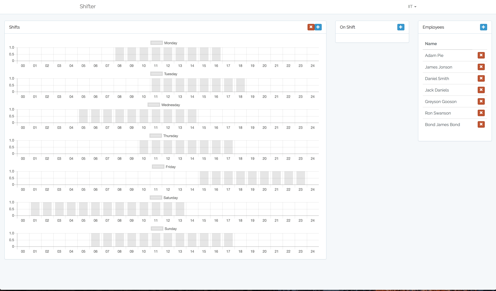

# Shifter [](https://jenkins.adampie.co.uk/job/adampie/job/shifter/job/master/)
Shift Management Application



## TO BUILD
```
./BUILD-AND-RUN.sh
```
Then browse to your docker-machine ip for example http://192.168.99.100/

### CRITERIA
- HATEOS API (Laravel)
- JS Frontend (VueJS)
- Authentication (Yes + Route auth)
- Persistence of Data (Data stored on PostgreSQL)
- Automated Testing (Kind of, I am building projects on Jenkins using the new Blue Ocean UI)

LAST BUILD => https://jenkins.adampie.co.uk/blue/organizations/jenkins/adampie%2Fshifter/detail/master/86/pipeline

Note => Adding a shift worker does not work
